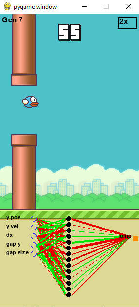
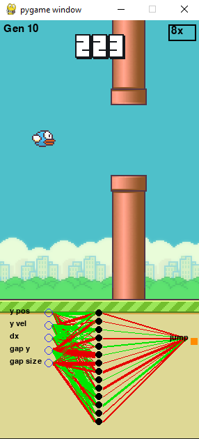
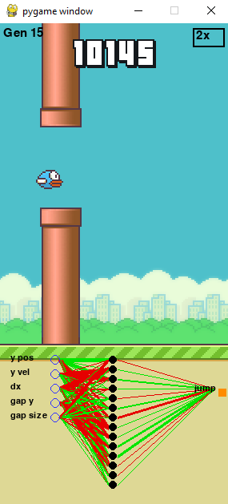

# Flappy-Bird-with-MLP-GA

A playable and learnable Flappy Bird simulation where an AI learns to play the game using a genetic algorithm and a simple feedforward neural network.  
Features both human-controlled and AI-controlled modes with real-time training and visualization.

---

## 🕹️ Game Highlights

While the core mechanics resemble the original Flappy Bird, this version includes several **custom-designed mechanics** that make it uniquely suited for AI learning:

- **Dynamic Pipe Gaps:** The pipe opening (`gap_size`) decreases as the player's score increases, making the game progressively harder. This prevents the AI from overfitting to a fixed, easy configuration.
- **Smooth Difficulty Scaling:** The gap reduces every 10 points passed, linearly scaling from 160 px (easy) to 100 px (hard).

---

## 🤖 AI & Genetic Algorithm

The AI controlling the bird uses a single-hidden-layer feedforward neural network (MLP) trained via neuroevolution — a Genetic Algorithm (GA) that directly evolves the weights without any backpropagation or gradient descent.

- **Input Layer:** 5 neurons (state vector)
  - Bird's vertical position (y)
  - Bird's vertical velocity (vy)
  - Distance to the next pipe (dx)
  - Vertical center of the pipe gap (gap_y)
  - Size of the pipe gap (gap_size)
- **Hidden layer:** 14 neurons with `tanh` activation.
- **Output layer:** 1 neuron with `sigmoid` activation.
- **Decision rule:** The bird flaps if the output > 0.5.

The network has 99 parameters (weights + biases), which are flattened into a genome vector and evolved over generations.

---

### 🧬 Genetic Algorithm Details

- The population size (`POP`) is 500 birds per generation.
- Elitism is applied by directly copying the top 4 performers (`HOF = 4`).
- Tournament selection is used (`TOUR_SIZE = 8`) to pick parents.
- Crossover is uniform with 50% probability per gene.
- Mutation is applied per gene with probability 0.25 and Gaussian noise scaled by `SIGMA`, initially 0.6 and decaying 3% per generation (`SIGMA_DECAY = 0.97`).
- Fitness is calculated as:  
  `score² × 40 + time_alive / 3`  
  Birds with `score = 0` and `lifetime < 180 ticks` are assigned zero fitness.
- Only the top ~3% of the population (`POP // 30`) are selected as parents, encouraging elitism and fast convergence.

---

## 📊 Real-Time AI Visualization

- The best bird's neural network is visualized on screen in real time.
- Green and red lines show connection weights; node layout is fixed.
- Includes interactive speed control (1x, 2x, 4x, 8x) during evolution.

---

## 📸 AI Training Snapshots

AI performance can vary due to **randomness** and **luck** in the genetic algorithm. Results may differ in each run, and strong performance might appear in different generations.
Here are snapshots of the AI's learning progress across generations:

### 🐥 Generation 7 (AI learned most of the game can score 50-80)

### 🐦 Generation 10 (AI learned %99.9 of the game can reach to 1000)

### 🦅 Generation 15 (To Infinity)

## 📁 Assets Credit

All visual and sound assets are from the open-source [samuelcust/flappy-bird-assets](https://github.com/samuelcust/flappy-bird-assets) repository.

> Credit: [samuelcust](https://github.com/samuelcust)
